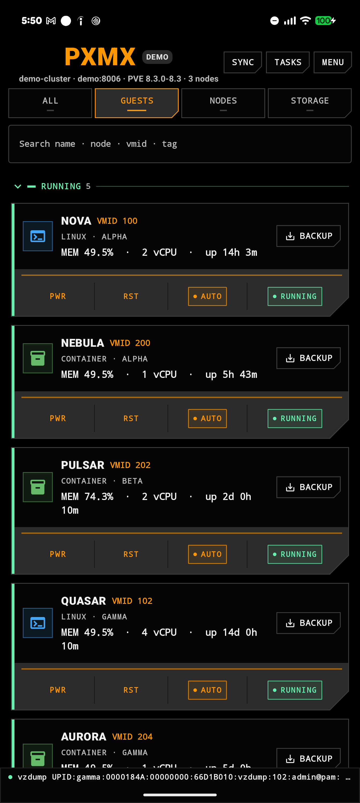
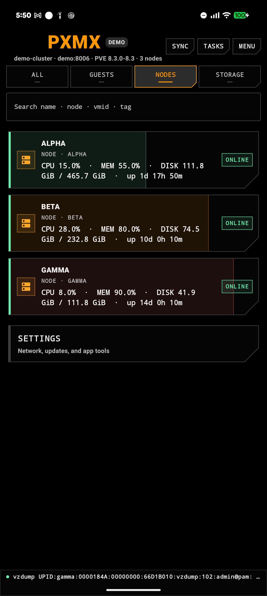
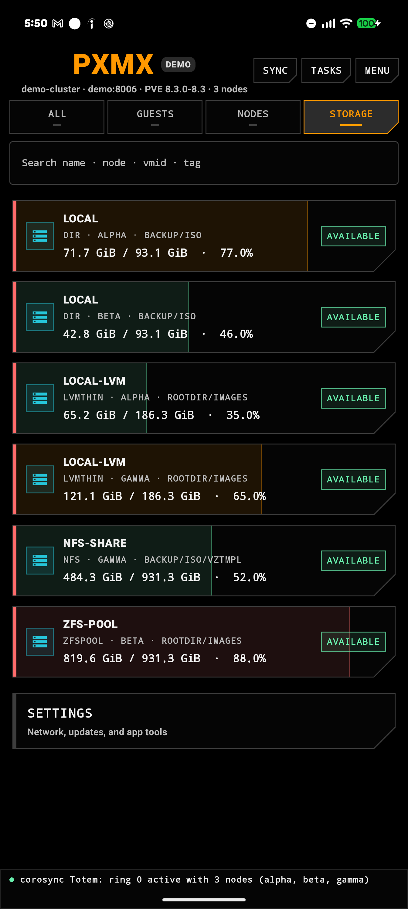
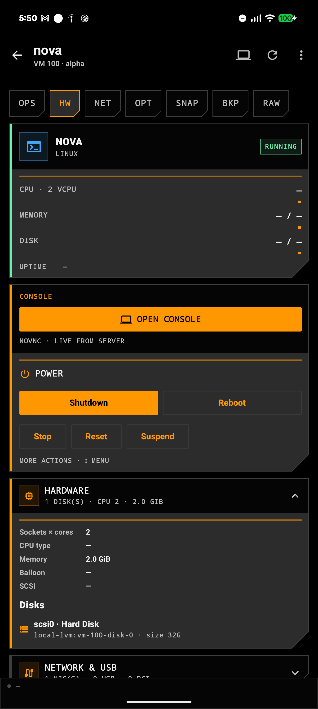
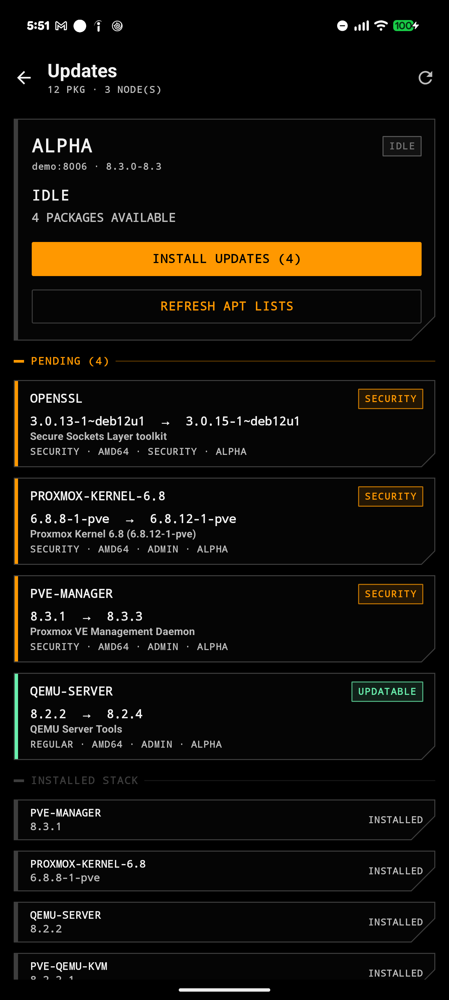
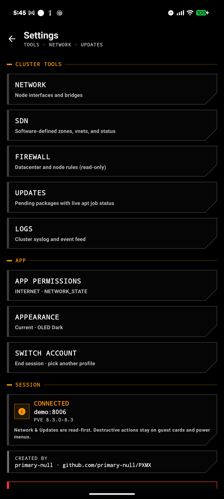

# PXMX

*An Android client for Proxmox VE.*

 

PXMX puts your Proxmox VE cluster in your pocket. It talks straight to your
servers over TLS, from a phone-sized interface: check nodes and guests, start
and stop machines, deploy from a template, back up, update, and open a console
when a host needs hands-on attention.

**Connect**

| Area | What you get |
| --- | --- |
| Sign in | Password, API token, or TOTP two-factor. With "Trust self-signed" on, the first connection pins the server's certificate; if it ever changes, the app refuses rather than silently re-accepts. |
| Saved servers | One profile per server. Only the host and username are stored; passwords and tokens live in encrypted storage keyed by the Android Keystore. |
| Network discovery | Scan the local network for Proxmox hosts. Results come back as verified, needs your login, or unknown, and tapping one jumps straight into signing in. |
| Server check | Test a saved server at any time: online state, version, and latency. |
| All servers | One screen that probes every saved host and shows what is up. |
| Open in browser | Jump from any screen to the matching page in the web UI. |

**Day to day**

| Area | What you get |
| --- | --- |
| Home | Guests, nodes, and storage at a glance, with the newest cluster events pinned below. |
| Nodes | Per-node status: CPU, memory, and disk fills, plus remote state. |
| Storage | Usage fills across all your datastores. |
| Guests | Power actions (start, stop, reboot, suspend, resume, reset), auto-start, and a deploy-from-template dialog. |
| Backups | Start and delete backups from the guest menu. |
| Updates | Refresh package lists and apply updates with a live, step-by-step progress view. On Proxmox VE 9, where the API no longer allows remote installs, the app walks you to the node shell command instead. |
| Console | An interactive SSH console for guests, and a node shell for the host. |
| Firewall and SDN | Read-only views of cluster firewall rules and SDN zones and vnets. |

**The app itself**

| Area | What you get |
| --- | --- |
| First-run tour | A short walkthrough of the main screens the first time the app opens. |
| Demo mode | Explore the whole interface on canned sample data, clearly labeled, with no server and no network involved. |
| Clean slate | A deliberate, held-down wipe that removes everything the app has stored, for when the phone changes hands. |
| Look | Light and dark theme, following the system by default. |

## Screenshots

Tap any shot for the full size.

|  |  |  |
| --- | --- | --- |
| [](docs/screenshots/01-home.png) | [](docs/screenshots/02-nodes.png) | [](docs/screenshots/03-storage.png) |
| [](docs/screenshots/04-guest-detail.png) | [](docs/screenshots/05-updates.png) | [](docs/screenshots/06-settings.png) |

## Get it

Download the latest APK from the
[Releases](https://github.com/primary-null/PXMX-VE/releases) page and install
it on your phone (allow installs from unknown sources; there is no store
involvement and no account to create). First run opens on the demo screen, so
you can look around before you point it at a server.

New here? The [user guide](https://primary-null.github.io/PXMX-VE/) walks
through every screen.

## Build it yourself

Plain Android project. Clone it, open it in Android Studio, and press Run, or
build from the command line:

```
./gradlew :app:assembleDebug
```

## Privacy

- TLS everywhere. Self-signed hosts get their certificate pinned on first
  login, and a changed identity is refused, never silently re-accepted.
  CA-signed hosts use the system trust store.
- Passwords and API tokens are encrypted at rest with Android
  EncryptedSharedPreferences, keyed by the Android Keystore. Session tickets
  live only in memory, never on disk.
- No accounts, no telemetry, no analytics, no cloud. The app talks only to
  the servers you add, and demo mode touches nothing at all.

## Permissions

Two, both silent, with no pop-ups:

| Permission | Why |
| --- | --- |
| Internet | Reach your Proxmox servers. |
| Network state | Find hosts on your local network. |

Details are listed in the app under **Settings > App permissions**.

## License

GPL-3.0. See [LICENSE](LICENSE).
